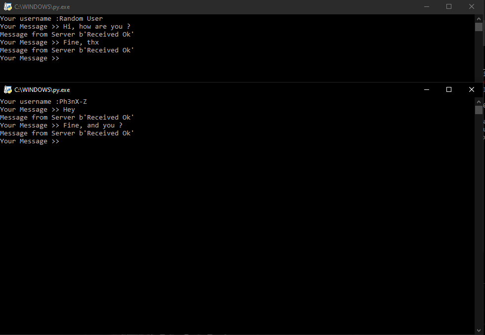
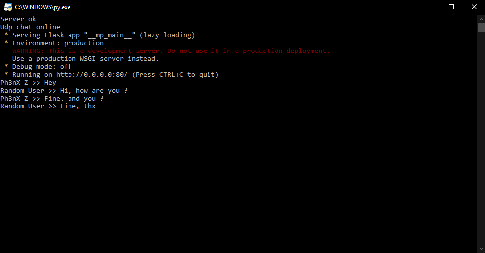
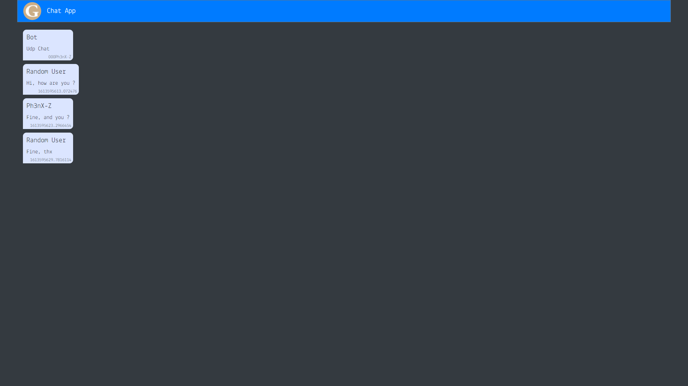

# Udp-Chat
Online Chat using user datagram protocol

## Usage

#### Clone or download the repo :

```sh
git clone https://github.com/Ph3nX-Z/Udp-Chat.git

or download zip 
```
#### Run The Server :

```sh

Linux : python3 server.py

Windows : python3.exe server.py or run with an interpreter
```
#### Run as many clients as you want :

```sh
Linux : python3 client.py

Windows : python3.exe client.py or run with an interpreter
```

#### Check the Webpage:

```sh
Url : https://yourip:80/
```

## Media

### Client


### Server


### Site


## Contributing

1. Fork it (<https://github.com/yourname/yourproject/fork>)
2. Create your feature branch (`git checkout -b feature/fooBar`)
3. Commit your changes (`git commit -am 'Add some fooBar'`)
4. Push to the branch (`git push origin feature/fooBar`)
5. Create a new Pull Request